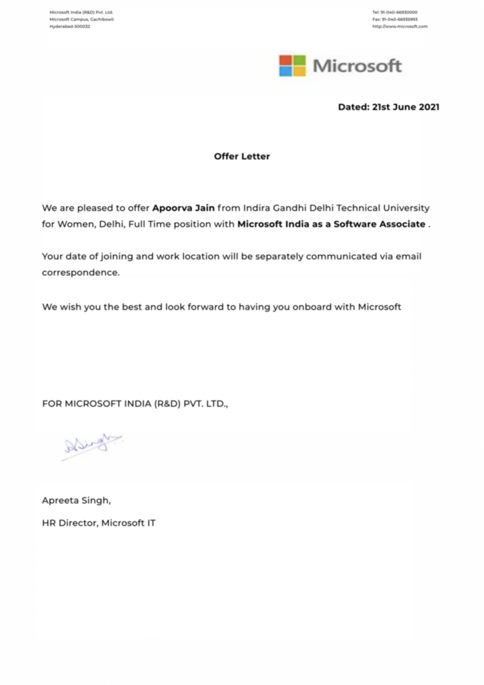
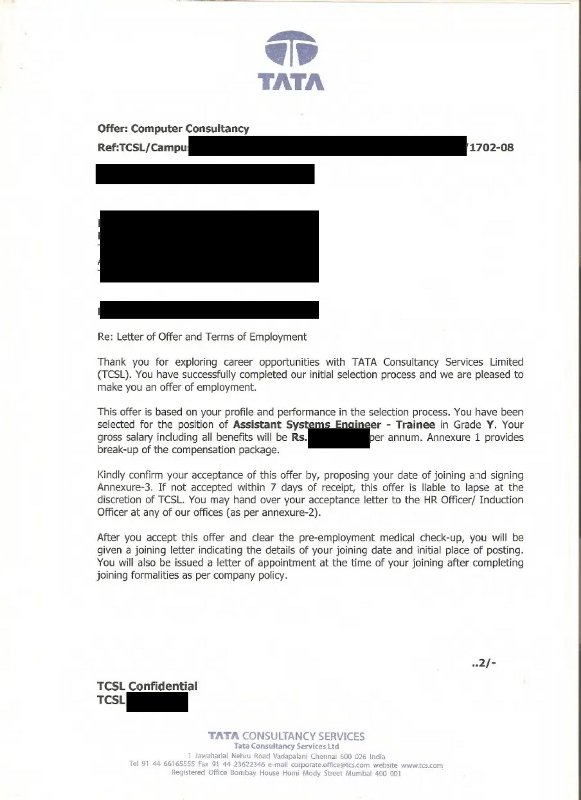
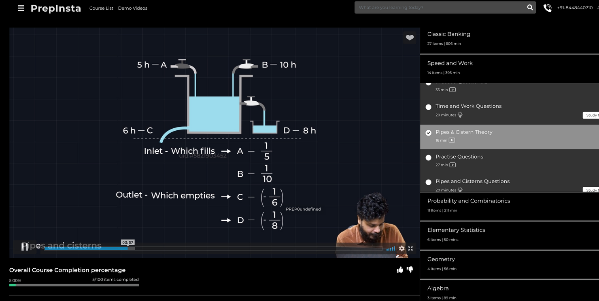
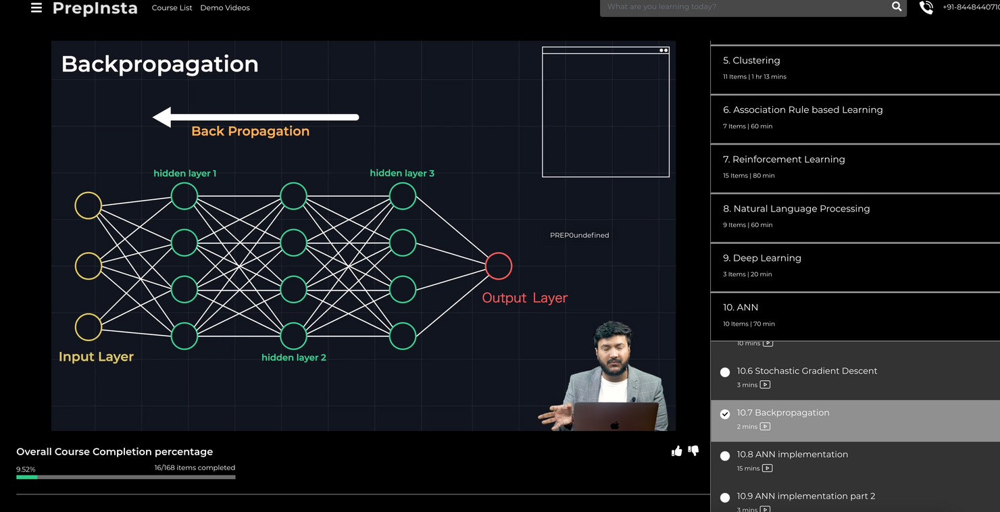
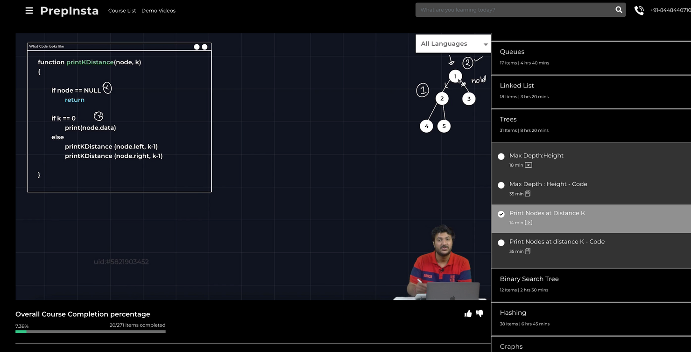
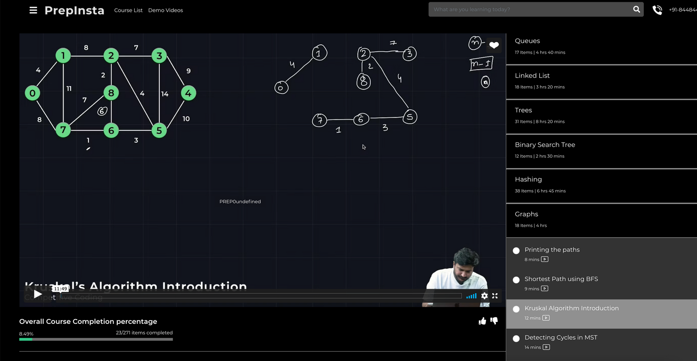
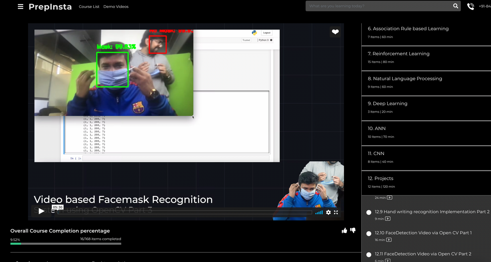
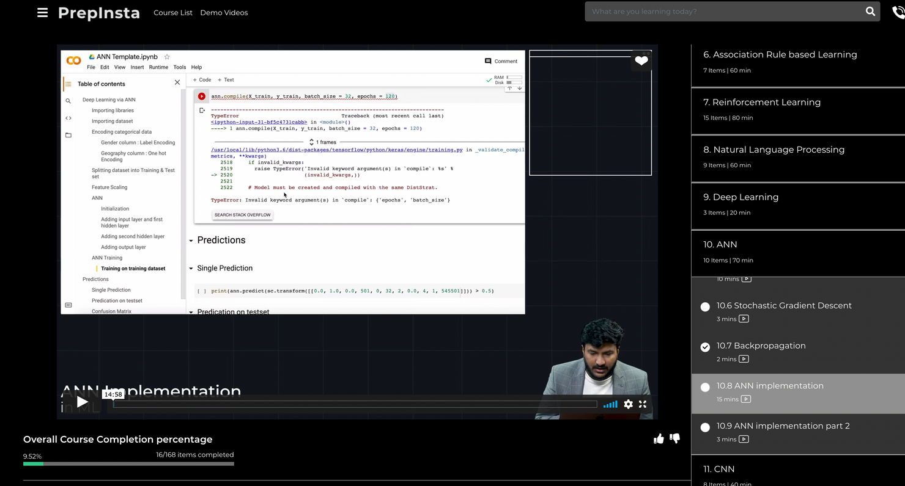
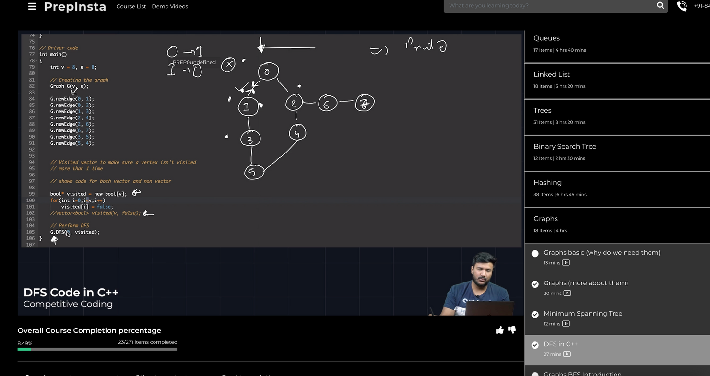

## My PrepInsta Prime Review (Placed in TCS Digital, Microsoft etc)

Hi this Apoorva Jain, you can call me apoorva or techgaga (my Youtube name) or Ayushi (what my mom calls me). I am sharing my experience of how I got placed in different companies and also how PrepInsta helped me to do so. Happy Reading Folks !!!!

By studying from PrepInsta Prime got Placed in 7 different companies the following is the list -

1. TCS Digital (7 LPA)
2. Microsoft (40 LPA)
3. Cisco (21 LPA)
4. Wipro
5. Capgemini
6. Cognizant
7. Accenture

### My Experience With PrepInsta Prime

The platform is amazing and will help anyone prepare well, even if you're preparing for product based companies or even service based companies or even to learn coding or new skills

The following are the things you get from PrepInsta (Will explain them one by one later)

1. 200+ courses under PrepInsta prime Subscription
2. Access to PrepInsta Placement cell
3. Doubt Solving
4. Mentorship
5. Best Teachers
6. Additional Live Classes

I will also tell how my interviews went with Microsoft and TCS digital and how PrepInsta helped me crack them

### PrepInsta Prime Courses

I completed the following courses, even though there are 200+ courses that you can access just like NetFlix
I was very bad at coding, I couldn't even solve basic First year college programs like Palindrome or reversing a number

1. Basic Coding - Aimed at people like me who are zero at coding, I completed this course and it gave me confidence to solve basic coding questions

2. Intermediate coding - This is a little advanced coding mostly advanced problems on arrays/strings

3. DSA - This is the best course in PrepInsta. Atulya sir has taught this very well. I am in ECE student and I was not good in coding. But I could even solve hard leetcode questions of DSA based on Graphs, Trees, Bitwise etc

4. Competitive Coding - This is very important if you want to get placed in high paying companies like Microsoft, Cisco, TCS digital etc

5. Machine Learning and AI - Again if you want to get placed in high paying companies you need to learn some skill also apart from coding. As these companies are hiring you and paying you extra so that they can hire best talent and people who can code well and have knowledge of some trading skills (Infact I got placed in TCS digital and Microsoft primarily because of this course)

### Other courses that I completed -

1. Aptitude, Reasoning, Verbal (Important for clearing online Tests)
2. C/C++ (Important for Interviews for service based companies)
3. Python
4. Puzzles (Almost all interviews that I attended they asked puzzles 3-4 puzzles were same as given in PrepInsta Course)
5. TCS NQT course (Amazing course with Extra theory for TCS and previous papers)
6. TCS digital
7.Wipro

### Final Verdict

1. As you can see that you need a lot of courses to get placed, you can keep buying new courses again and again for different things. PrepInsta solves this as they have subscription model where you can access all 200+ courses

2. Initially, I tried YouTube videos of Love babbar and Apna college etc. 

3. But they teach too many irrelevant things in their courses. Most of it isn't important for placements

4. PrepInsta provided focussed preparation like the whole platform is amazingly organized.

5. Udemy doesn't have good DSA, Competitive Coding, Aptitude, Basic/intermediate course. Trust me !! I also bought 4.8 rated DSA course on Udemy that is top selling and it was SHITTT !!!! 

6. I had taken top selling Udemy course on Python and Machine Learning in my 2nd year it was decent. But, PrepInsta python and ML/AI course was better

7. Its cheap also, coding ninjas and upgrad etc but they are costly. Upto 30,000 PrepInsta is subscription is much cheaper. Around 5000 for 2 years.

8. They also helped with referrals via PrepInsta Placement Cell, I got referral in Microsoft and Cisco

All in all PrepInsta is the best subscription that you can take. I would definitely recommend anybody.

Infact my 2 college friends and my brother (in 2nd year college) got their subscription after i recommended them and they also like PrepInsta.

Also, not sure that they mention it on their website. But, they send referrals to people who complete their Competitive Coding/DSA course.

I got call from PrepInsta that If i want to apply to Amazon, Cisco, Microsoft. I am eligible as completed DSA/Comp. Coding. I got referred from them

1. Cleared Microsoft Interview 
2. Cleared Cisco Interview
3. Got Rejected in Amazon however.

I missed a few pointers but, right now I am tired. I will update this post within 1 week to talk more about following later -

1. Doubt Solving
2. Mentorship
3. Best Teachers
4. Additional Live Classes

But even my experience with above 4 points is positive.
